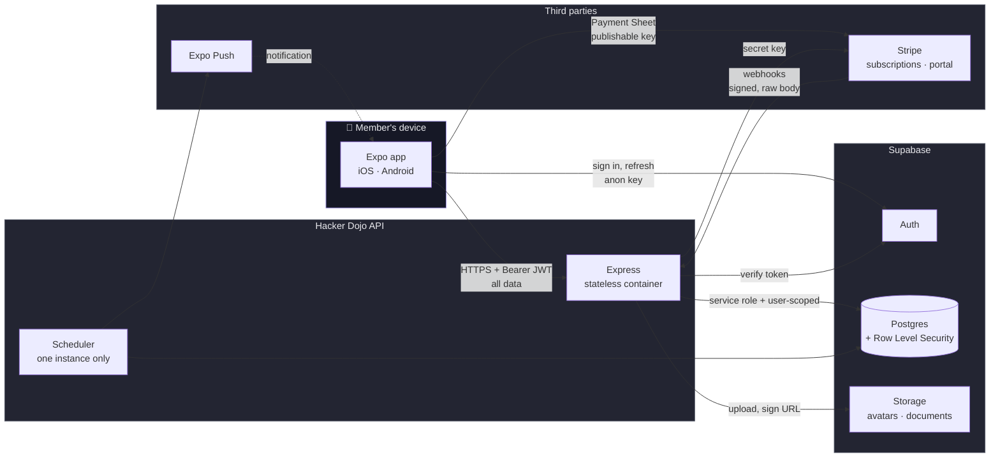
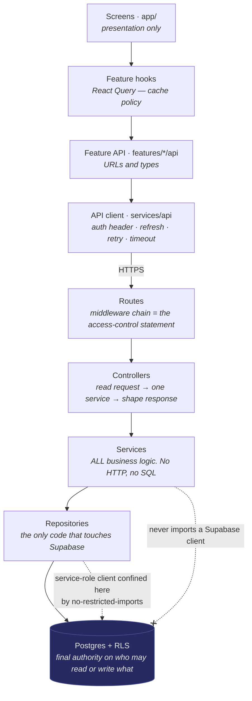
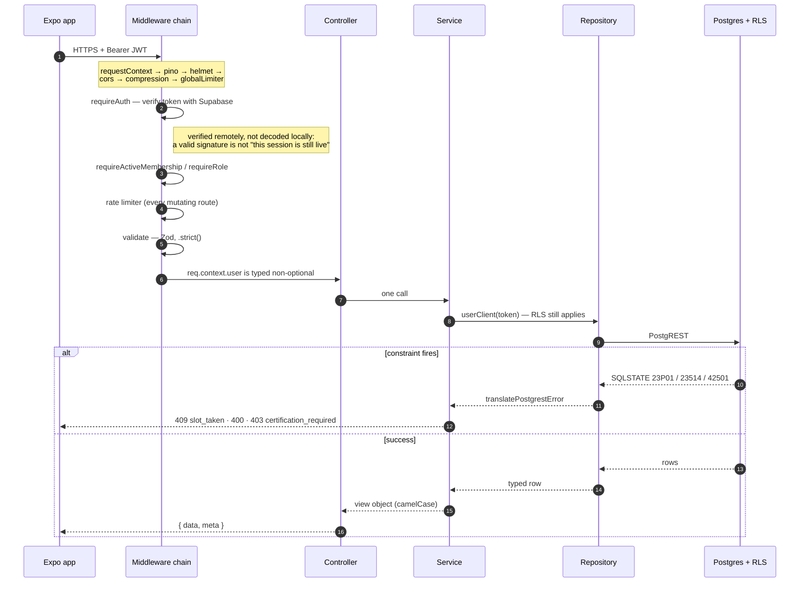
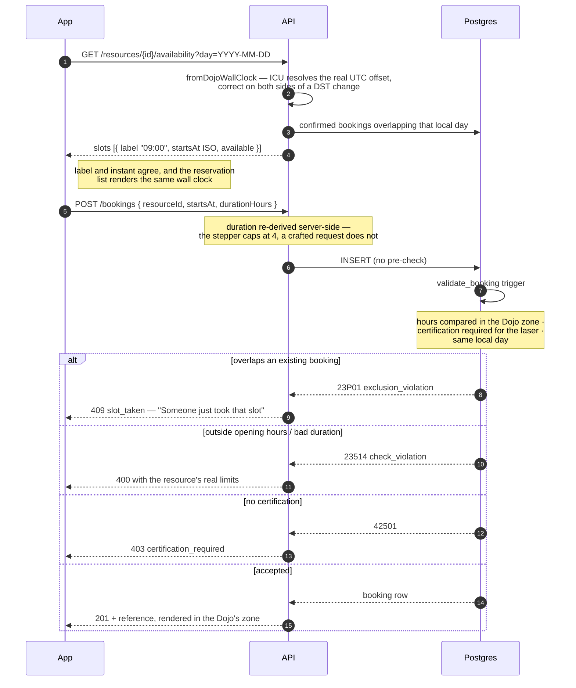
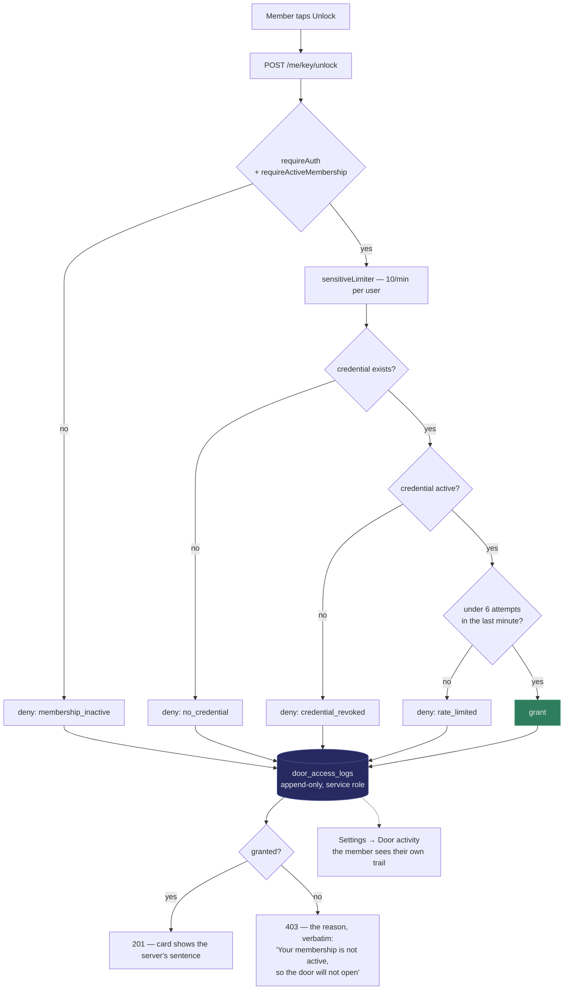
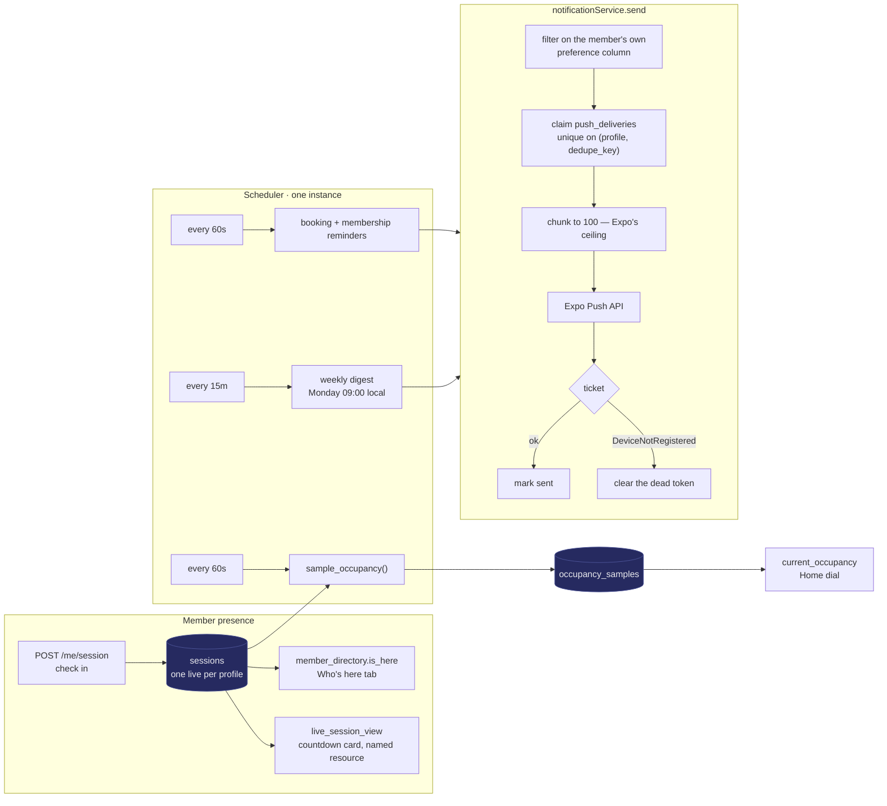
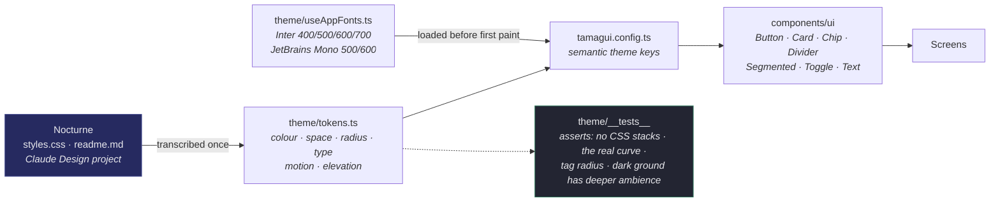
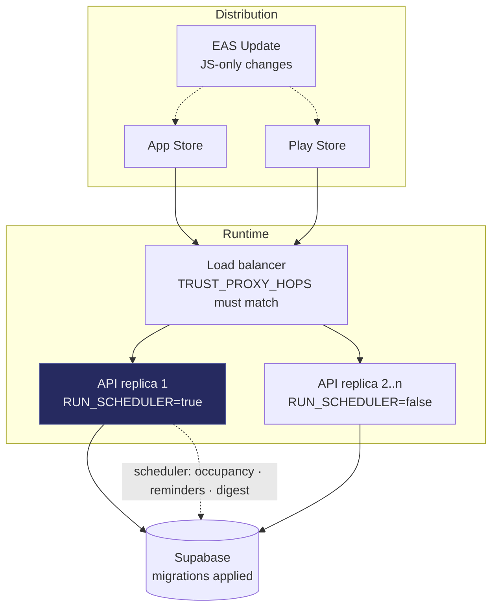

# Hacker Dojo — Architecture

The member platform end to end: one Expo app for iOS and Android, an Express API,
and a Supabase data plane, with Stripe for money and Expo for push.

This document describes the system **as built** after the production hardening
pass. Every diagram reflects code in this repository rather than an intended
design — where a rule is enforced by a database constraint or a lint rule rather
than by convention, the diagram says so.

---

## 1. System context

Two things are worth reading off this diagram before anything else.

**The app talks to Supabase for authentication only.** Sessions, OTP, OAuth and
token refresh go directly to Supabase Auth with the anon key; _no data query ever
does_. Everything else is mediated by the API, which is what allows business
rules to live in one place and be enforced regardless of what the client sends.

**Nothing on the device holds a secret.** The anon key is safe because RLS is the
protection, and the Stripe publishable key is designed to be public. The
service-role key and the Stripe secret key exist only in the API's process.

---

## 2. Layers

Layers run one way. Nothing skips a step and nothing calls back upward.

The two dashed boundaries are the ones that are **mechanically enforced** rather
than agreed: an ESLint `no-restricted-imports` rule confines the Supabase clients
to `server/src/repositories/**`, and RLS means a bug in a service produces an
empty result set instead of a data leak.

**Business logic is never in the app.** Prices, capacity, booking rules and
membership state are decided server-side. The client renders what it is told and
asks for what it wants; it never computes an amount to charge or decides that
someone is a member.

---

## 3. Request lifecycle

Every request passes the same chain. Read the middleware on a route declaration
as the access-control statement it is — `requireAuth` means signed in,
`requireActiveMembership` means a paying member, `requireRole` means staff.

Two ordering details are load-bearing. The Stripe webhook is mounted **before**
the JSON parser and takes the raw body, because signature verification hashes the
exact bytes Stripe sent. And validation replaces `req.body` with the parsed
value, so a request that smuggles `role: "admin"` is a 422 rather than a field
that quietly reaches an update.

Every failure arrives at a screen as one `ApiError`. Screens branch on `code`,
never on a status number or a message string, so copy changes on the server
cannot silently break error handling on the device.

---

## 4. Membership — subscriptions and the webhook

Memberships are **real Stripe Subscriptions**. The subscription is created with
`payment_behavior: 'default_incomplete'`, which returns the first invoice's
PaymentIntent for the sheet to confirm and leaves the subscription inactive until
it does — so an abandoned checkout never grants access, and renewals, dunning and
cancellation arrive as webhooks for free.

**Entitlement is granted only by `customer.subscription.*`.** The client's
confirmation call decides nothing, and `payment_intent.succeeded` deliberately
does not grant membership either — two writers would race.

The claim/confirm protocol on the right is the fix for a bug that could take a
member's money without activating them: the event id is reserved before the work
and `processed_at` is set only after it succeeds, so a failure releases the claim
for Stripe's retry instead of having it discarded as "already handled".

```mermaid
sequenceDiagram
    autonumber
    participant App
    participant API
    participant Stripe
    participant PG as Postgres

    rect rgb(35, 37, 50)
    Note over App,PG: Checkout — the client sends a plan id and a period, never an amount
    App->>API: POST /payments/membership-intent<br/>{ planId, period, idempotencyKey }
    API->>PG: read plan → price id + amount
    API->>Stripe: subscriptions.create(default_incomplete)
    Stripe-->>API: subscription + client secret
    API->>PG: payments row (processing)
    API-->>App: client secret + ephemeral key
    App->>Stripe: confirm in Stripe's own Payment Sheet
    end

    rect rgb(38, 42, 96)
    Note over Stripe,PG: Entitlement — the only channel that grants membership
    Stripe->>API: customer.subscription.created (signed, raw body)
    API->>PG: claimWebhookEvent(id)

    alt already processed
        PG-->>API: processed_at is set
        API-->>Stripe: 200 — drop the replay
    else claimed
        API->>Stripe: retrieve subscription (source of truth)
        API->>PG: upsert membership on stripe_subscription_id
        API->>PG: promote profile guest → member

        alt work succeeded
            API->>PG: markWebhookProcessed
            API-->>Stripe: 200
        else work threw
            API->>PG: markWebhookFailed — processed_at stays NULL
            API-->>Stripe: 5xx → Stripe redelivers, and it is treated as new
        end
    end
    end

    App->>API: GET /me (after a short delay)
    API-->>App: isActiveMember flips the gated surfaces
```

Renewal, cancellation and dunning reuse the same `syncSubscription` path —
`invoice.paid` re-reads the subscription, `invoice.payment_failed` marks the
membership `past_due`. Members manage everything else in Stripe's hosted Billing
Portal, minted per tap because portal links are single-use.

---

## 5. Booking — the timezone and the constraint

Two independent correctness mechanisms meet here.

**The clock.** `resources.opens_at` is a Postgres `time`, which only means
something against a zone. Both the slot builder and the `validate_booking`
trigger now resolve it through `America/Los_Angeles` — one shared answer, given
by `dojoTimezone()` in SQL and `DOJO_TIMEZONE` in TypeScript. Previously they
disagreed, and the "09:00" a member tapped reserved 09:00 UTC: 02:00 in Mountain
View.

**The race.** There is no availability check before the insert, on purpose.
Check-then-insert is a time-of-check/time-of-use race; the `bookings_no_overlap`
GiST exclusion constraint decides, and the loser gets a 409 translated from
SQLSTATE 23P01.

---

## 6. The front door

This flow used to be theatre: a hardcoded key id and a local animation that
reached "Access granted" without contacting anything, so a lapsed member got the
same green tick as a paid-up one and nobody who was locked out left a trace.

Every attempt is now a decision the server makes, and **every attempt writes an
audit row — refusals especially**, because those are the rows someone needs when
a member says the door would not open. The rate limit is deliberately doubled:
the HTTP limiter lives in one process and resets on deploy, so a second counter
is derived from the audit log itself.

---

## 7. Presence, occupancy and push

Three things run on a clock, and none of them existed before: `sessions` had no
writer so the directory's presence dot was permanently off, `occupancy_samples`
had no writer so the Home dial was frozen on seed data, and push tokens were
stored and never sent to.

The scheduler is a plain interval rather than a job queue — the work is
idempotent and measured in milliseconds — but it is **not distributed**.
`RUN_SCHEDULER` must be true on exactly one instance, or every sample and every
notification doubles.

The delivery row is claimed **before** the request goes out, so a crash mid-batch
is safe to retry — the same guard the Stripe webhook uses.

---

## 8. Data model

The tables that carry the rules. RLS is on for every one of them; the annotations
name the constraint or policy doing the work rather than restating the columns.

```mermaid
erDiagram
    PROFILES ||--o| MEMBERSHIPS : "one live row max"
    PROFILES ||--o| DOOR_CREDENTIALS : "issued by server only"
    PROFILES ||--o{ DOOR_ACCESS_LOGS : "append-only audit"
    PROFILES ||--o{ BOOKINGS : "own rows only"
    PROFILES ||--o{ EVENT_RSVPS : ""
    PROFILES ||--o{ DOCUMENTS : "verification"
    PROFILES ||--o| SESSIONS : "one live per profile"
    PROFILES ||--o| NOTIFICATION_PREFERENCES : "consent"
    PROFILES ||--o{ PUSH_DELIVERIES : "exactly-once"

    PLANS ||--o{ MEMBERSHIPS : "stripe_price_* required"
    RESOURCES ||--o{ BOOKINGS : "GiST no-overlap"
    RESOURCES ||--o{ CERTIFICATIONS : "gates requires_cert"
    ZONES ||--o{ RESOURCES : ""
    ZONES ||--o{ OCCUPANCY_SAMPLES : ""
    EVENTS ||--o{ EVENT_RSVPS : "capacity trigger"
    PAYMENTS ||--o{ DONATIONS : ""

    PROFILES {
        uuid id PK
        text role "pinned by RLS — no self-promotion"
        bool directory_visible
        text avatar_path "resolved to a URL server-side"
    }
    MEMBERSHIPS {
        text stripe_subscription_id UK "the entitlement record"
        text status "active·trialing·past_due·canceled"
        timestamptz current_period_end
    }
    BOOKINGS {
        tstzrange slot "generated — exclusion constraint"
        text status
    }
    DOOR_CREDENTIALS {
        text key_id UK "minted by issue_door_credential()"
        bool active
    }
    STRIPE_WEBHOOK_EVENTS {
        text id PK
        timestamptz processed_at "NULL = claimed but unfinished"
        int attempts
    }
    SITE_SETTINGS {
        text key PK
        bool members_only "the Wi-Fi password lives here"
    }
    CONTENT_BLOCKS {
        text slot "impact · pillars — editable without a deploy"
    }
```

Four correctness guarantees live in Postgres rather than in a service, because
the obvious implementation of each is subtly wrong:

| Guarantee         | Mechanism                                                         | Why not in a service                             |
| ----------------- | ----------------------------------------------------------------- | ------------------------------------------------ |
| No double-booking | `bookings_no_overlap` GiST exclusion                              | check-then-insert loses the race                 |
| Event capacity    | trigger downgrades `going` → `waitlisted` in the RSVP transaction | same race, plus the honest answer must come back |
| No self-promotion | `profiles` update policy pins `role`                              | a client controls what it sends                  |
| Webhook replay    | insert into `stripe_webhook_events` first                         | at-least-once delivery becomes effectively-once  |

---

## 9. Design system pipeline

Nocturne is the source; nothing below the theme layer hard-codes a hex or a
pixel. The transcription is one file, and it is now verified by tests rather than
by review — a CSS fallback stack that React Native cannot resolve looks perfect
in a code review and renders the entire app in the wrong typeface.

Both appearances are real. Nocturne is natively dark; the Hacker Dojo layer
inverts the ground to white and swaps the blurple accent for the brand red. The
app follows the OS setting and honours an explicit override from Settings.

---

## 10. Deployment shape

The API is a stateless container: `npm run build && npm start`. It answers
`GET /health`, verifies its Supabase and Stripe credentials at startup and exits
non-zero in production if either is wrong, and drains in-flight requests on
`SIGTERM` — a hard exit would cut a member off mid-checkout, after Stripe was
called but before the response landed.

Configuration required before first deploy is listed in `README.md` and
`server/.env.example`. The three that block everything else: Stripe Price ids on
the `plans` rows, the five required server environment values, and applying
`supabase/migrations/20260805000000_production_hardening.sql`.
